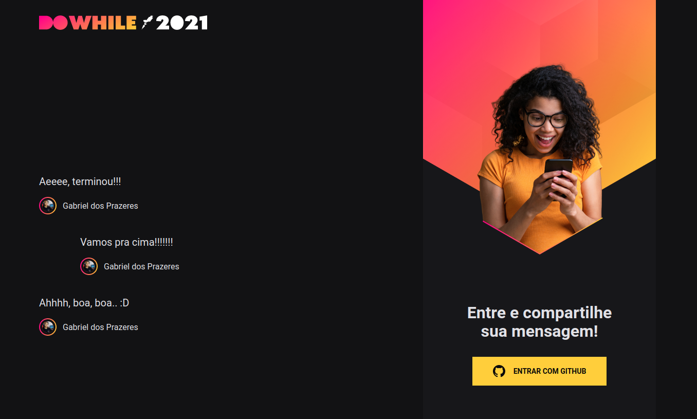
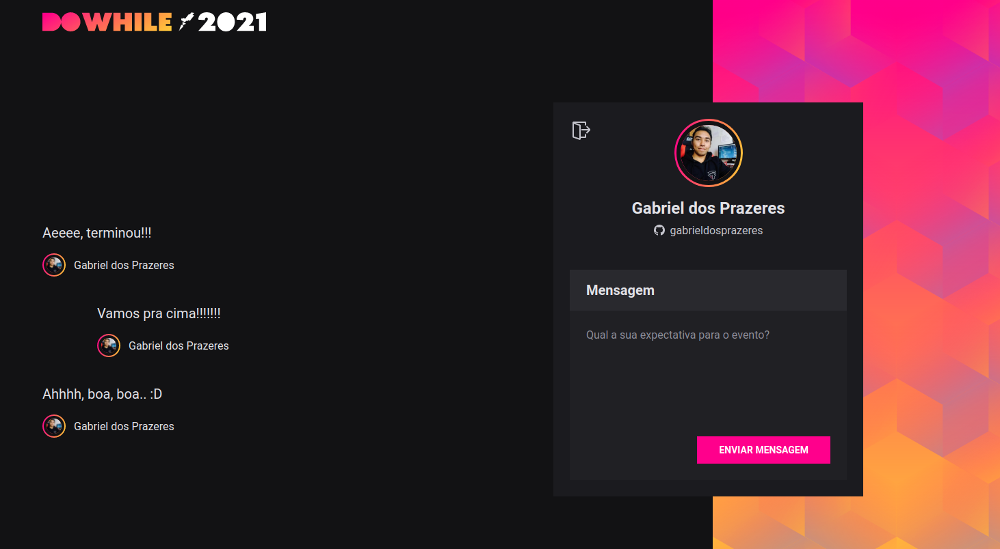

<p align="center">
  

  
  
  <a href="https://github.com/gabrieldosprazeres/nlw-heat-7th-edition/commits/master">
    
  </a>
    
   
</p>

<h1 align="center">
    
</h1>

## 💻 Sobre o projeto

Projeto Full Stack construído com ReactJS utilizando TypeScript para o Front End e NodeJS com Axios e Socket.io para o Back End.

Projeto desenvolvido durante a **NLW - DoWhile2021** oferecida pela [Rocketseat](https://blog.rocketseat.com.br/primeira-next-level-week/).
O NLW é uma experiência online com muito conteúdo prático, desafios e hacks onde o conteúdo fica disponível durante uma semana.

---

## ⚙️ Funcionalidades

- [x] Usuários podem se cadastrar utilizando a conta do GitHub e:

  - [x] Conversar sobre qualquer assunto em um chat simultâneo

---

## Web

<p align="center" style="display: flex; align-items: flex-start; justify-content: center;">
<h3>Login</h3>
  
<h3>Logado</h3>
  
</p>

---

## 🚀 Como executar o projeto

Este projeto é divido em três partes:

1. BackEnd (pasta server)
2. FrontEnd (pasta web)

💡O FrontEnd que o BackEnd esteja sendo executado para funcionar.

### Pré-requisitos

Antes de começar, você vai precisar ter instalado em sua máquina as seguintes ferramentas:
[Git](https://git-scm.com), [Node.js](https://nodejs.org/en/).
Além disto é bom ter um editor para trabalhar com o código como [VSCode](https://code.visualstudio.com/)

#### 🎲 Rodando o BackEnd (servidor)

```bash

# Clone este repositório
$ git clone git@github.com:gabrieldosprazeres/nlw-heat-7th-edition.git

# Acesse a pasta do projeto no terminal/cmd
$ cd nlw-heat-7th-edition

# Vá para a pasta server
$ cd server

# Instale as dependências
$ yarn

# Execute a aplicação em modo de desenvolvimento
$ yarn dev

# O servidor inciará na porta:4000 - acesse http://localhost:4000

```

#### 🧭 Rodando a aplicação web (FrontEnd)

```bash

# Clone este repositório
$ git clone git@github.com:gabrieldosprazeres/nlw-heat-7th-edition.git

# Acesse a pasta do projeto no seu terminal/cmd
$ cd nlw-heat-7th-edition

# Vá para a pasta da aplicação Front End
$ cd web

# Instale as dependências
$ yarn

# Execute a aplicação em modo de desenvolvimento
$ yarn dev

# A aplicação será aberta na porta:3000 - acesse http://localhost:3000

```

---

## 🛠 Tecnologias

As seguintes ferramentas foram usadas na construção do projeto:

#### **Website** ([React](https://reactjs.org/) + [TypeScript](https://www.typescriptlang.org/))

- **[React Router Dom](https://github.com/ReactTraining/react-router/tree/master/packages/react-router-dom)**
- **[React Icons](https://react-icons.github.io/react-icons/)**
- **[Axios](https://github.com/axios/axios)**
- **[Socket.io](https://socket.io/)**

> Veja o arquivo [package.json](https://github.com/tgmarinho/README-ecoleta/blob/master/web/package.json)

#### [](https://github.com/tgmarinho/Ecoleta#server-nodejs--typescript)**Server** ([NodeJS](https://nodejs.org/en/) + [TypeScript](https://www.typescriptlang.org/))

- **[Express](https://expressjs.com/)**
- **[CORS](https://expressjs.com/en/resources/middleware/cors.html)**
- **[SQLite](https://github.com/mapbox/node-sqlite3)**
- **[ts-node](https://github.com/TypeStrong/ts-node)**
- **[dotENV](https://github.com/motdotla/dotenv)**

> Veja o arquivo [package.json](https://github.com/tgmarinho/README-ecoleta/blob/master/server/package.json)

---

## 💪 Como contribuir para o projeto

1. Faça um **fork** do projeto.
2. Crie uma nova branch com as suas alterações: `git checkout -b my-feature`
3. Salve as alterações e crie uma mensagem de commit contando o que você fez: `git commit -m "feature: My new feature"`
4. Envie as suas alterações: `git push origin my-feature`

---

## 📝 Licença

Este projeto esta sobe a licença [MIT](./LICENSE).
